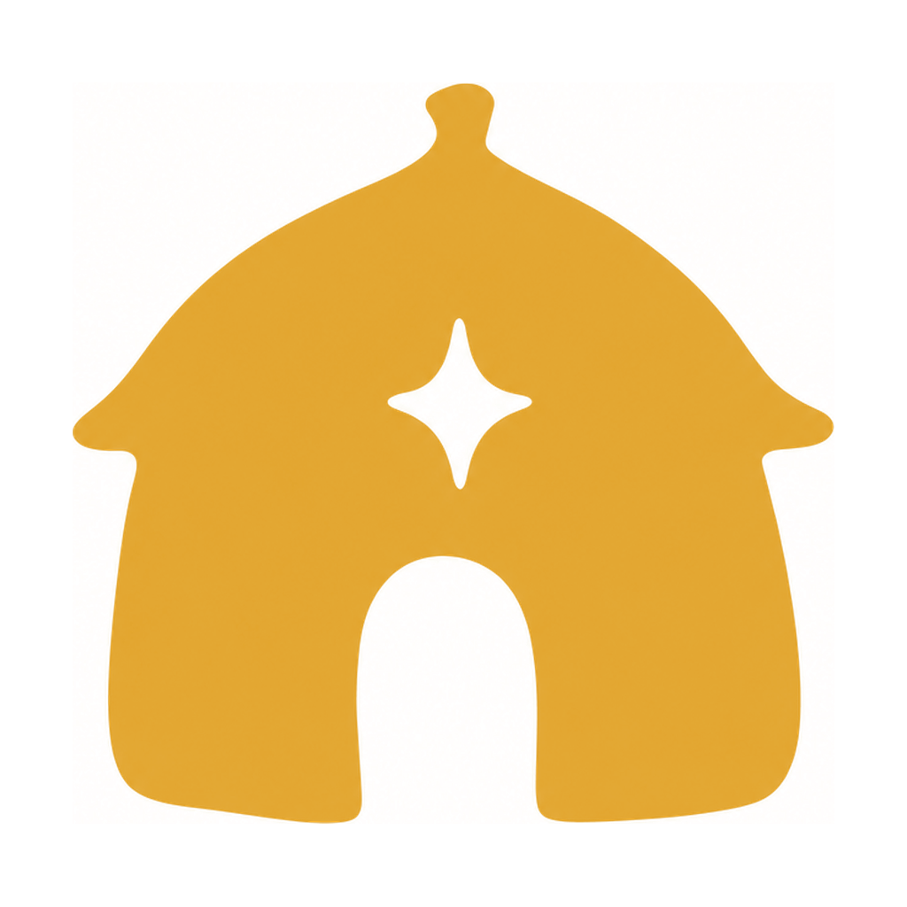

<div align="center">



# Domovoi

**The house daemon for your Mac.**

The domovoi is the Slavic hearth spirit that lives in the home and keeps it running. This one tends your machine: iMessage and Contacts today, Notes, Reminders, Notifications and more as they land.

<a href="https://www.buymeacoffee.com/hello_emrah"></a>

</div>

---

Domovoi is a local Model Context Protocol server for the native side of your Mac. It reads the on-disk stores directly (read only) and acts through AppleScript, so an assistant can read and search your iMessage history, resolve handles to the people behind them, and send a message. Built for personal use, shared openly, not productised.

Runs entirely on your machine. Nothing leaves the Mac.

## Tools

| Tool | What it does |
|---|---|
| `messages_list_chats` | Most recent conversations with their last-activity time |
| `messages_read` | Read a thread (by number, email, or contact name) or recent messages across all chats, decoding the `attributedBody` blobs a naive read would miss |
| `messages_search` | Search message text across all conversations |
| `messages_send` | Send an iMessage to a handle |
| `contacts_search` | Find people in Contacts by name, number, or email |

## Requirements

- macOS, with Messages signed in.
- **Full Disk Access** for the host app (the program that launches this server). Reading `~/Library/Messages/chat.db` and the AddressBook stores is gated by macOS privacy. System Settings, Privacy and Security, Full Disk Access, then relaunch the app.
- **Automation** permission for sending. macOS prompts the first time `messages_send` runs ("… wants to control Messages"). Approve it once.
- Node 18 or newer. No native build: reads go through the system `sqlite3` CLI.

## Install

```bash
git clone https://github.com/hello-emrah/domovoi-mcp.git
cd domovoi-mcp
npm install
```

## Wire into Claude

Add to your MCP config (`~/.claude.json` or Claude Desktop config):

```json
{
  "mcpServers": {
    "domovoi": {
      "command": "node",
      "args": ["/absolute/path/to/domovoi-mcp/index.js"]
    }
  }
}
```

No environment variables, no keys. Access is governed entirely by the macOS permissions above.

## Notes

- All reads are read only against copies of Apple's stores; the server never writes to them.
- Modular by design. Each surface is its own file under `src/`; new ones (notes, reminders, notifications, shortcuts, system info) register in `index.js` without touching the rest.

## Why "Domovoi"

The domovoi is the Slavic house spirit, the guardian that lives in the home and keeps it running: fed, respected, tending the hearth out of sight while the household sleeps. It is the same idea the word daemon carries in computing, the quiet process that keeps a machine in order without ever asking for attention. This one tends your Mac.

## Design philosophy

The visual mark and the tool itself were built deliberately against the visual language of capitalist software design. No gradients, no neon, no glass, no drop shadows, no isometric stock illustration. Single-shade flat seals in warm, considered colours, ancient-glyph silhouettes, generous whitespace. The mark could be pressed into wax or carved into stone.

This tool is built for personal use and shared openly. It is not productised, monetised, or instrumented. Use it for your own work or fork it for yours.

## License

MIT.
